# Conceitos de Processamento de Linguagem Natural

## Fundamentos de IA do Microsoft Azure

- Conceitos de processamento de linguagem natural
- Capacidades de processamento de linguagem natural no Azure

## Objetivos de Aprendizado

- Reconheça quando o processamento de linguagem natural e a IA conversacional podem ser usados.
- Identifique os serviços de IA do Azure que incluem processamento de linguagem natural.
- Use a análise de texto para você mesmo.

## O que é processamento de linguagem natural?

Existem vários processamentos de linguagem natural (PLN) que podem ser aplicados a um texto para 
extrair informações, entender o significado e realizar tarefas específicas. Aqui estão alguns dos 
principais processamentos de linguagem natural:

1. Tokenização:
Divide o texto em unidades menores, como palavras ou frases.

2. Análise Morfológica:
Identifica as partes constituintes das palavras, como raízes e sufixos.

3. Análise Sintática:
Analisa a estrutura gramatical das sentenças, identificando a relação entre as palavras.

4. Análise Semântica:
Compreende o significado das palavras e frases em um contexto específico.

5. Desambiguação Semântica:
Resolve ambiguidades de significado em palavras ou frases.

6. Reconhecimento de Entidades Nomeadas (NER):
Identifica e classifica entidades, como nomes de pessoas, locais e organizações.

7. Extração de Relacionamentos:
Descobre relações semânticas entre entidades no texto.

8. Classificação de Texto:
Atribui categorias ou rótulos a textos com base no conteúdo.

9. Agrupamento de Texto:
Agrupa documentos ou sentenças semelhantes.

10. Sumarização de Texto:
Cria resumos concisos do conteúdo de um texto.

11. Tradução Automática:
Converte texto de uma língua para outra.

12. Reconhecimento de Sentimentos:
Determina a emoção expressa no texto, como positiva, negativa ou neutra.

13. Geração de Linguagem Natural:
Produz texto de forma automática com base em determinados inputs ou contextos.

14. Questionamento e Resposta:
Compreende perguntas e fornece respostas relevantes.

15. Análise de Opinião:
Avalia opiniões e sentimentos expressos em relação a um determinado tópico.

Esses são apenas alguns exemplos, e há muitas outras tarefas e técnicas dentro do campo do processamento 
de linguagem natural, dependendo dos objetivos específicos de aplicação. O PLN é uma área em constante 
evolução, com novas abordagens e técnicas sendo desenvolvidas regularmente.

## Conceitos de processamento de linguagem natural

Processamento de linguagem natural e IA conversacional no Azure

> - NER (Reconhecimento de Entidade Nomeada)
> - Detecção de PII e PHI
> - Detecção de idioma
> - Análise de Sentimentos
> - Respostas a perguntas
> - Fala

1. NER (Reconhecimento de Entidade Nomeada):
Identificação e extração de entidades específicas, como nomes de pessoas, locais, organizações, datas, 
valores monetários, etc.

2. Detecção de PII (Informações Pessoais Identificáveis) e PHI (Informações de Saúde Protegidas):
Identificação e proteção de informações sensíveis, como números de cartão de crédito, números de 
seguro social, informações médicas, etc.

3. Detecção de Idioma:
Determinação do idioma em que o texto está escrito.

4. Análise de Sentimentos:
Avaliação do tom emocional do texto, indicando se o autor expressa sentimentos positivos, negativos 
ou neutros.

5. Respostas a Perguntas:
Compreensão de perguntas feitas em linguagem natural e fornecimento de respostas relevantes.

6. Fala:
Processamento de fala para reconhecimento de voz e síntese de fala.

## Texto para fala

- Conversão de texto para fala
- Conversão da fala para texto
- Tradução de fala

No Azure, você pode utilizar vários serviços para realizar tarefas específicas relacionadas ao processamento 
de linguagem natural (PLN) e inteligência artificial (IA) conversacional, incluindo a conversão de texto 
para fala, a conversão de fala para texto e a tradução de fala. Aqui estão alguns serviços relevantes:

1. Conversão de Texto para Fala:
Azure Speech Services: Este serviço permite converter texto em fala natural e expressiva. Você pode 
sintetizar voz em vários idiomas e estilos para incorporar respostas de fala em suas aplicações.

2. Conversão de Fala para Texto:
Azure Speech Services: Além da síntese de fala, o Azure Speech Services oferece recursos para transcrever 
automaticamente a fala em texto. Isso é útil para converter gravações de áudio em texto para análise e 
processamento posterior.

3. Tradução de Fala:
Azure Translator: Este serviço é dedicado à tradução de texto e fala. Ele pode traduzir conteúdo falado 
de uma língua para outra, permitindo a comunicação eficiente em diferentes idiomas.

Ao usar esses serviços em conjunto, você pode criar soluções avançadas que envolvem interações de 
linguagem natural e suportam múltiplos idiomas. Por exemplo, você poderia criar uma aplicação que 
recebe comandos de fala em um idioma, traduz esses comandos para outro idioma e fornece respostas 
em fala nesse idioma traduzido. Essas capacidades são essenciais para aplicações globais e multilíngues.

## Tradutor

Tradução do texto
- Tradução personalizada
- Tradução de documentos

No Azure, para realizar tradução de texto e documentos, você pode usar serviços específicos que oferecem 
funcionalidades avançadas para essas tarefas. Aqui estão alguns serviços relevantes:

1. Tradução Personalizada:

Azure Cognitive Services - Translator: O Azure oferece o serviço Translator, que permite a tradução de 
texto em tempo real entre diversos idiomas. Além disso, você pode criar modelos personalizados de tradução 
para atender a terminologias específicas da sua aplicação ou domínio. Isso é útil para garantir que a 
tradução seja adaptada ao contexto da sua aplicação.

2. Tradução de Documentos:

Azure Cognitive Services - Translator Document Translation: Esse serviço permite traduzir documentos 
inteiros de uma só vez. Ele suporta uma ampla variedade de tipos de documento, incluindo arquivos de 
texto, Word, PowerPoint, PDF e muito mais. Esse serviço é particularmente útil quando você precisa traduzir 
grandes volumes de conteúdo textual de uma vez.

Esses serviços do Azure fornecem a base para incorporar capacidades avançadas de tradução em suas aplicações. 
Eles são flexíveis o suficiente para atender a diferentes casos de uso, desde tradução em tempo real até 
tradução de documentos em lote. Ao integrar esses serviços, você pode construir soluções de tradução 
personalizadas e escaláveis para atender às necessidades específicas do seu projeto.

Capacidades de processamento de linguagem natural no Azure

## Resposta a perguntas

Defina uma base de conhecimento de pares de perguntas e respostas:
- Ao inserir perguntas e respostas
- De um documento de perguntas frequentes existente
- Usando bate-papo integrado

Serviço de bot do Azure

- Plataforma baseada em nuvem para desenvolvimento e gerenciamento de bots
- Integração com AI Language e outros serviços
- Conectividade através de vários canais
- Compreensão da linguagem coloquial

## Reconhecimento e síntese de fala

- Use os recursos de fala para texto do serviço Fala para transcrever fala audível em texto.
- Use os recursos de conversão de texto em fala do Serviço de Fala para gerar fala audível a partir de 
texto.

# Aplicação prática: 

## Explorando os recursos do Azure AI Service

Para executar, precisei utilizar o serviço Azure IA Service, através os seguintes passos:

1. Acessei o Azure Portal e efetuei o login com a minha conta Microsoft

2. Efetuei as configurações conforme apresentadas abaixo:
> - Nome do novo recurso: insira um nome exclusivo.
> - Assinatura: sua assinatura do Azure.
> - Região: selecione uma região suportada.
> - Nível de preços: FO gratuito (se disponível, caso contrário, selecione Standard S0).
> - Grupo de recursos: selecione ou crie um grupo de recursos com um nome exclusivo.

3. O serviço foi aprovisionado quando recebi a mensagem Your deployment is complete:

## Explorando a conversão de voz em texto no Speech Studio

1. Acessei o  [Azure AI Speech Studio](https://speech.microsoft.com/portal);
2. Aqui foi necessário associar o AI Speech Studio ao recurso Azure IA Service:
- Mudar recurso: 

- Selecionar recurso:

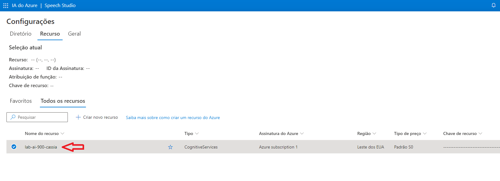

3. Selecione https://aka.ms/mslearn-speech-files para baixar o Speech.zip. Abra a pasta.

4. Na página Introdução à fala, em Fala para texto, localize "Fala em tempo real para texto". Selecione Experimente a fala em tempo real para texto:

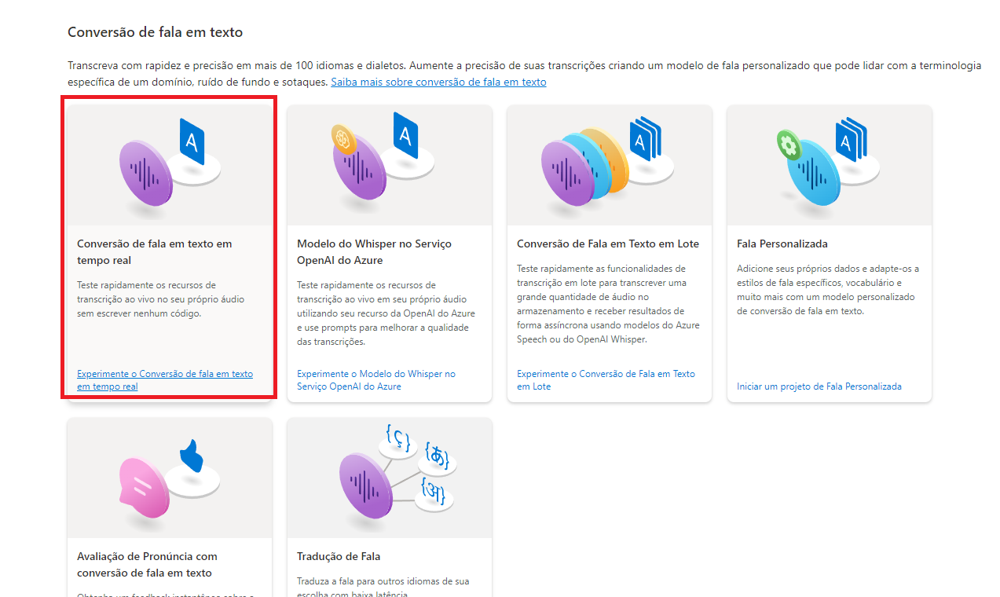

5. Em Escolher arquivos de áudio, selecione procurar arquivos e navegue até a pasta onde você salvou o arquivo. Selecione WhatAICanDo.m4a e abra o arquivo.

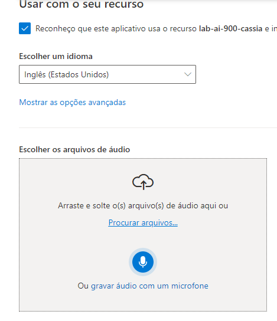

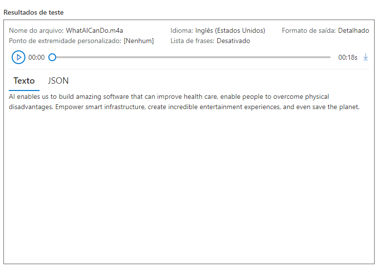

6. O serviço Speech transcreve e exibe o texto em tempo real. Se você tiver áudio em seu computador, poderá ouvir a gravação enquanto o texto é transcrito.

7. Após, revise a saída, que deve ter reconhecido e transcrito com êxito o áudio em texto.

# Crie um recurso de idioma para o  Language Studio

> Você pode usar muitos recursos do Azure AI Language com um recurso de idioma ou de serviços do Azure AI. Existem alguns casos em que apenas um recurso Idioma pode ser usado. Para o exercício abaixo, utilizaremos um recurso Linguagem. Se ainda não o fez, crie um recurso de idioma na sua assinatura do Azure.

1. Em outra guia do navegador, abra o portal do Azure em https://portal.azure.com, entrando com a conta da Microsoft associada à sua assinatura do Azure.

2. Clique no botão ＋Criar um recurso e procure por serviço de idioma. Selecione criar um plano de serviço de idiomas. Você será levado a uma página para selecionar recursos adicionais. Mantenha a seleção padrão e clique em Continuar para criar seu recurso.

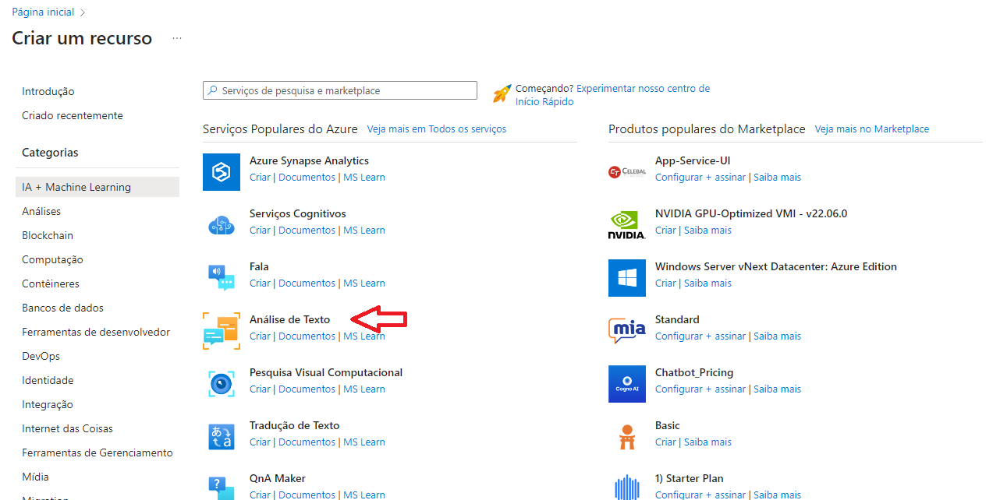

3. Na página Criar Idioma, configure-o com as seguintes configurações:
> - Assinatura: sua assinatura do Azure.
> - Grupo de recursos: selecione ou crie um grupo de recursos com um nome exclusivo.
> - Região: Leste dos EUA.
> - Nome: Insira um nome exclusivo.
> - Nível de preços: F0 grátis ou S se F0 grátis não estiver disponível
> - Ao marcar esta caixa, confirmo que li e compreendi todos os termos abaixo: Selecionado.

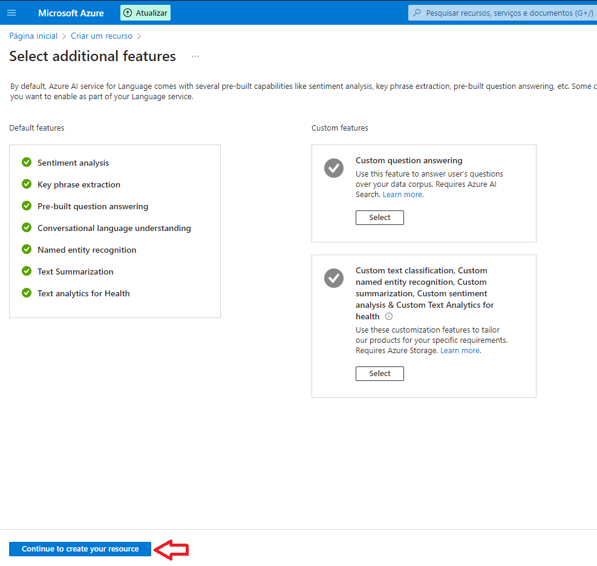

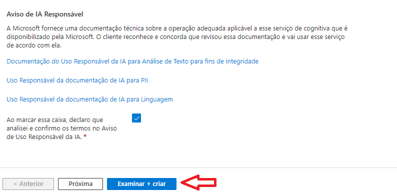

4. Selecione Revisar + criar e depois Criar e aguarde a conclusão da implantação.

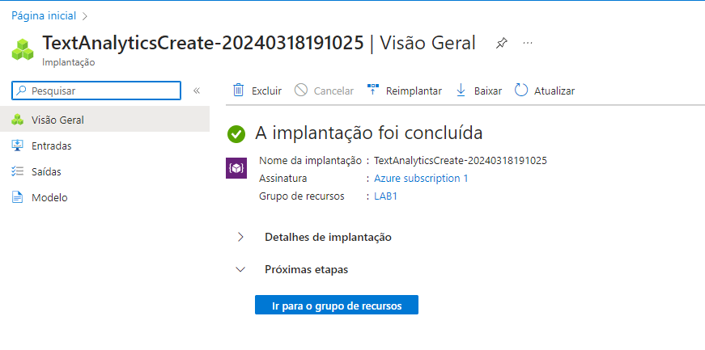

## Explorando a análise de sentimentos com o Azure Language Studio

1. Em outra guia do navegador, abra o Language Studio em https://language.cognitive.azure.com e entre.

2. Quando solicitado com Selecione um recurso do Azure, faça as seguintes configurações:
> - Diretório Azure: Diretório Padrão, o diretório que você está usando
> - Assinatura do Azure: selecione a assinatura que você está usando
> - Tipo de recurso: Idioma
> - Nome do recurso: selecione o recurso de serviço de idioma que você acabou de criar.
Em seguida, selecione Concluído.

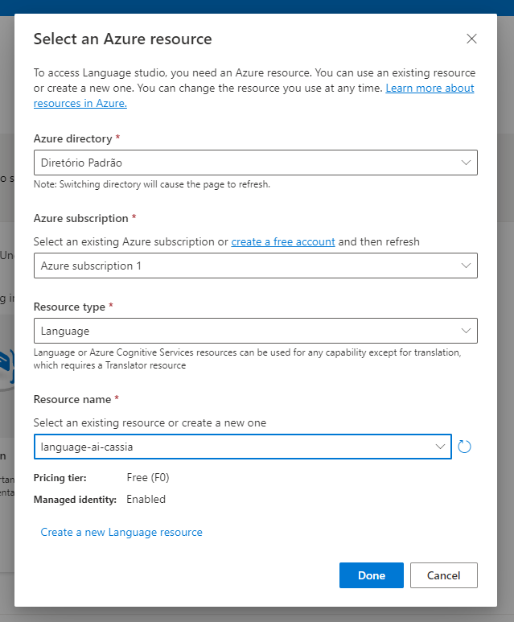

3. Selecionei a feature Analyze sentiment and mine opinions, que fica dentro do grupo Classify text:

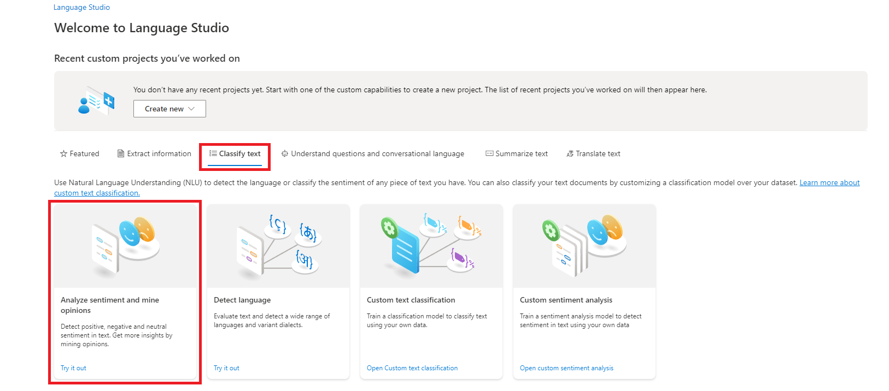

4. Em Selecionar idioma do texto, selecione Inglês.

5. Em Selecione o seu recurso Azure, selecione o seu recurso.

6. Em Digite seu próprio texto, carregue um arquivo ou use um dos textos de exemplo, peguei o arquivo de exemplo da documentação:

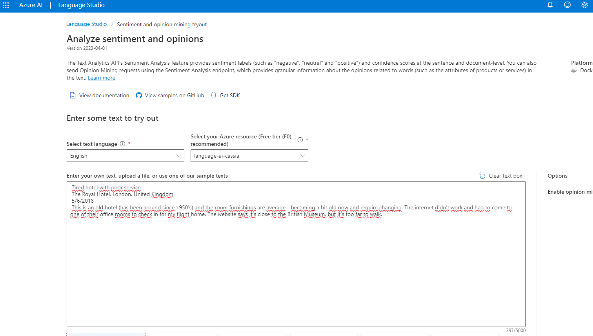

7. Marque a caixa para confirmar que a demonstração incorrerá em uso e poderá incorrer em custos e selecione executar.

8. Revise a saída. Observe que o documento é analisado quanto ao sentimento, assim como cada frase. 

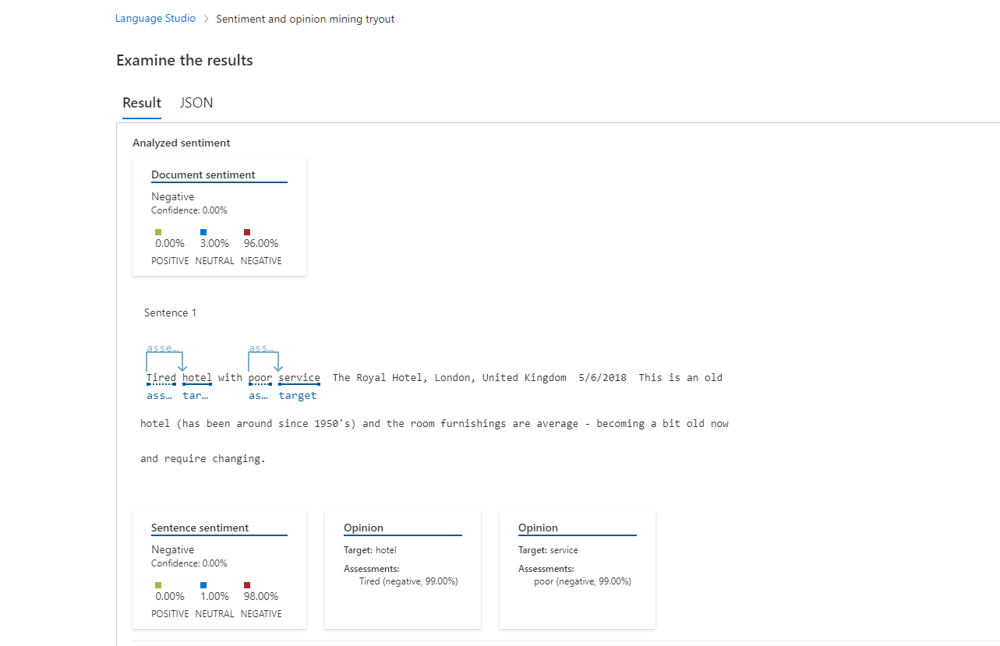

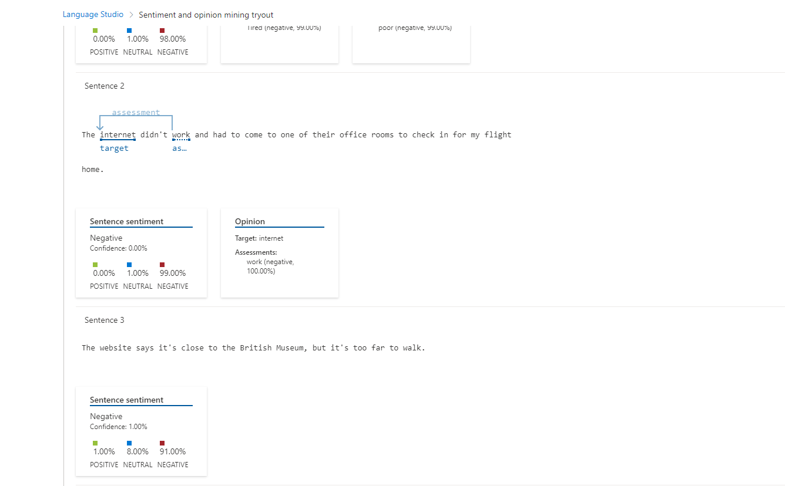

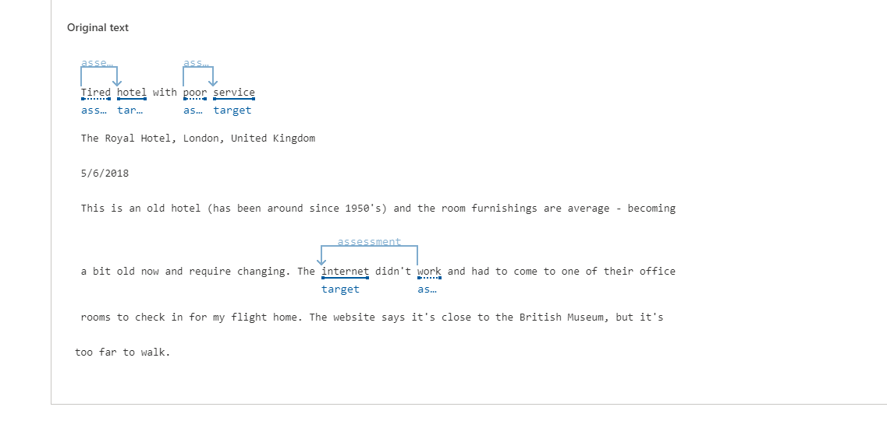

### Links

https://aka.ms/ai900-speech

https://aka.ms/ai900-text-analysis

https://speech.microsoft.com/portal

Documentação Oficial: https://learn.microsoft.com/en-us/training/paths/explore-natural-language-processing/